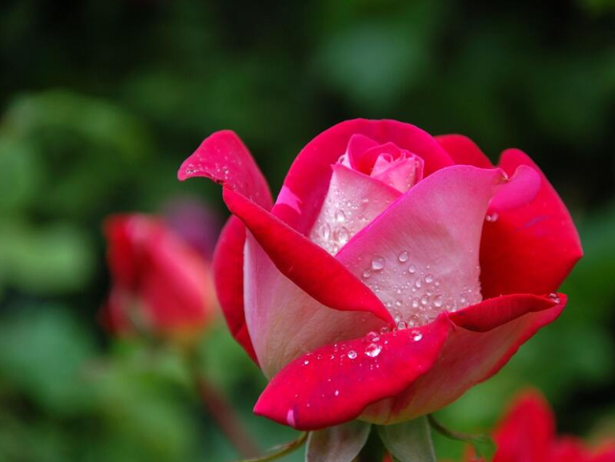
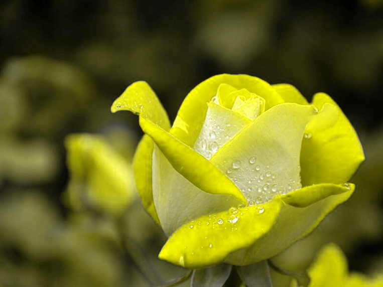

# PPM Picture Modifier

## Table of content

 * [General informations](#general-informations)
 * [Prerequisites](#prerequisites)
 * [Usage](#usage)
 * [build folder](#build-folder)
 * [images folder](#images-folder)
 * [log folder](#log-folder)
 * [src folder](#src-folder)
 * [tests folder](#tests-folder)
 * [Contact](#contact)

## General informations 

This project is a __photo modifier in PPM format__. The program has several image modification functions. The program is coded in C.
We recommand you to stock your pictures (under PPM format) in the _'images'_ repertory for easier utilization.

| Original picture | Modified picture |
| ------- | ------- |
|  |  |

## Prerequisites

__You need to use the prerequisites.sh file to download all the libraries needed to use this project.__
You can use this file with one of the following two commands:
 - bash prerequisites.sh
 - ./prerequisites.sh

 # Usage

A Makefile is present and several commands are available to use the project :
 - _“make”_ to compile evrything. 
 - _“make build”_ to compile all source  into _'build'_ directory.
 - _"make tests"_ to compile the tests, with the ‘test’ executable in the ‘build/’ directory.
 - _“make coverage”_ to obtain the project coverage code (!!! You must compile the tests first, otherwise it won't work!).
 - _“make clean”_ to delete all temporary files and logs.
With each command, a “make.log” file is created in the _'log/'_ directory.

## build folder

This directory contains all compiled, executable and coverage files. These are temporary files, and the directory is cleaned using the Makefile clean command.

## images folder

This directory is used to stock the pictures (under PPM format) for the user and for easier utilization.

## log folder

This directory contains logs written after the use of prerequisites.sh and Makefile.

## src folder

This directory contains all the libraries used by the "main.ino" file. All are programmed in C++ and are represented by classes with their own functions and variables. 
In general, the principle is as follows: We retrieve the pixels from the image and store them in a list. We then modify these pixels (RGB) according to the functions we want to perform. Conversion to HSV is also possible.

## tests folder

This directory contains all tests on files in the 'src/' directory. These tests are performed using the __check.h__ library. 

## Contact

Created by [@nemocazin] 